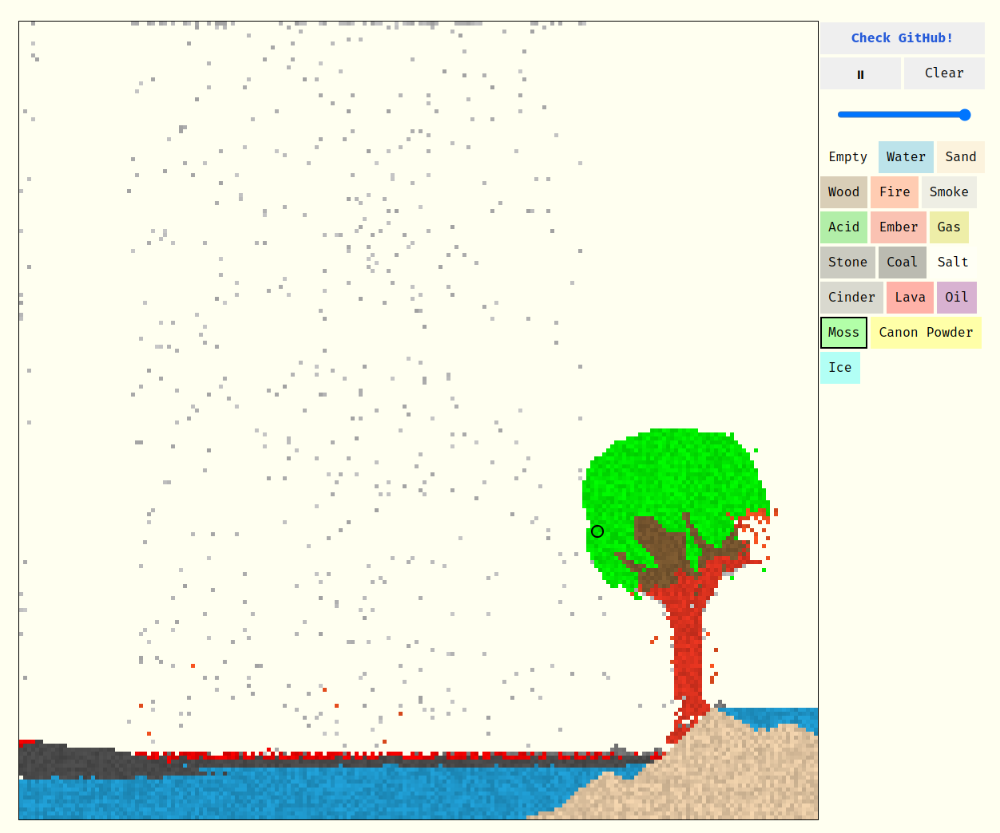

# Nito

Sandbox cellular automata simulation.
This project is the web vestion of the project [native Nito](https://github.com/ErwanGZL/Nito)

## Building and running

You can try the simulation by yourself at [Nito !](https://rclovis.github.io/Nito-Wasm/)

This project was developed in rust and ported to the web using wasm.

## Features:

### Technical

- Simulation is implemented on a Rust backend
- Graphical frontend is implemented in C++ using SFML
- Multithreaded frontend and backend
- Flexible frontend window dimensions
- Simulation can vary in size and speed

### Elements

- Water: falls and spreads
- Sand: falls and piles up
- Wood: stays in place, burns into embers
- Fire: flickers and decay
- Smoke: rises and decays, generated from burning embers
- Embers: generates fire and smoke, decays, turns into charcoal upon contact with water
- Charcoal: stays in place, burns into embers

## Authors

- [Erwan Gonzales](https://github.com/EstusSipper)
- [Clovis Rabot](https://github.com/rclovis)
